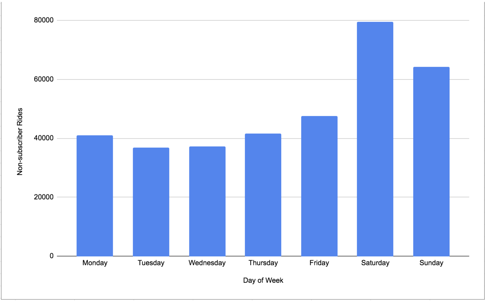
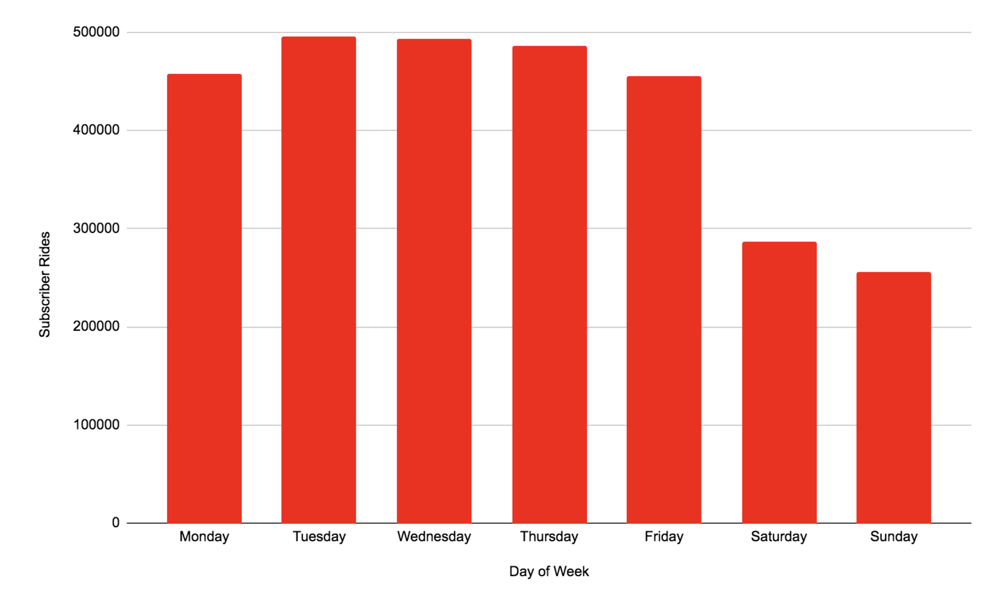
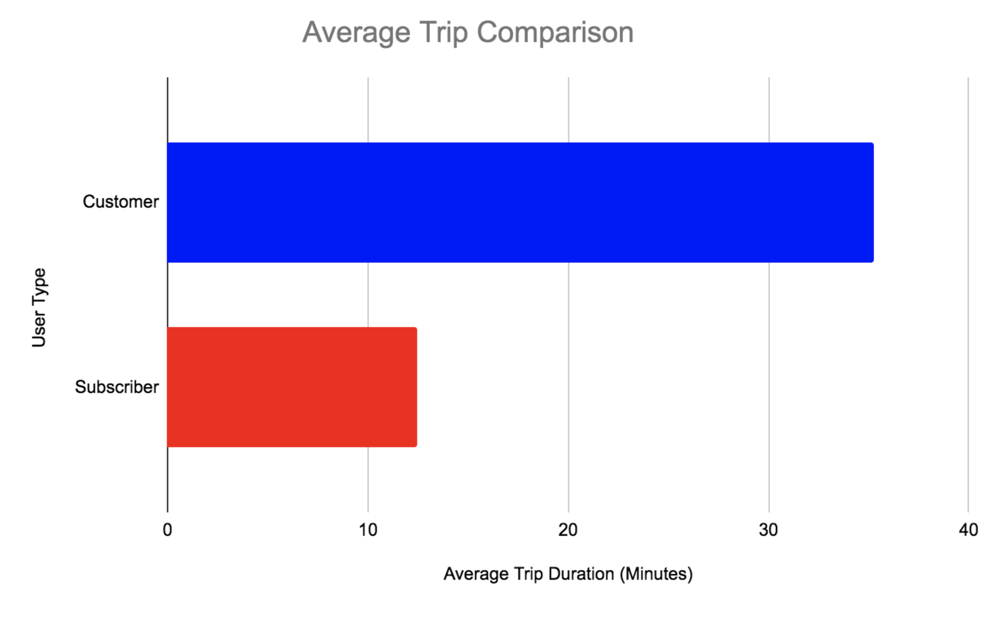
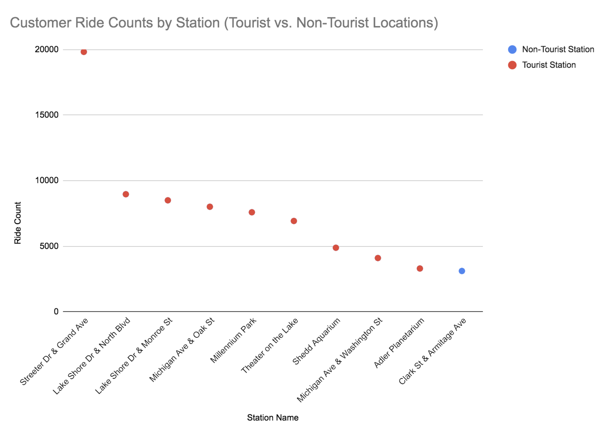
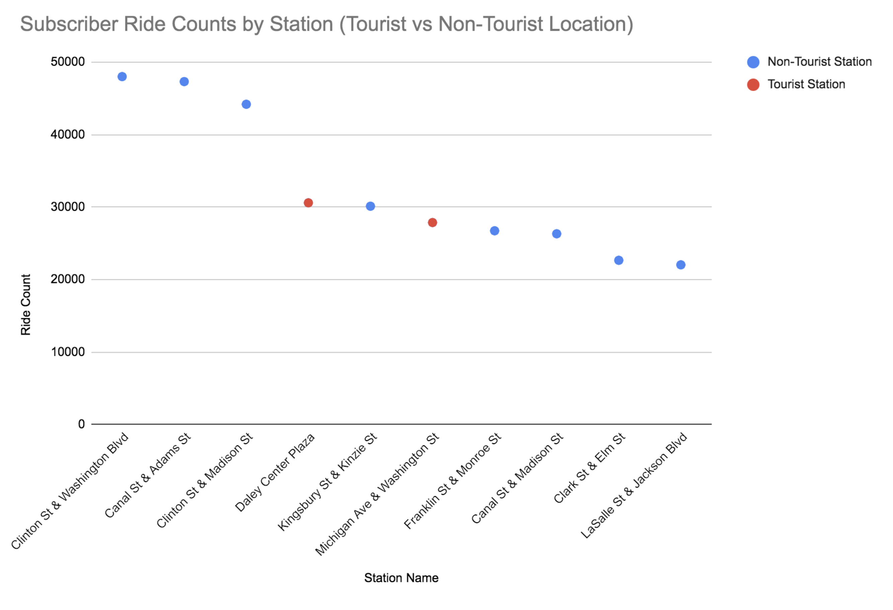

# Cyclistic Bike-Share — Capstone Case Study

---

## Project Overview
This project analyzes 12 months of Cyclistic bike-share data to understand behavioral differences between **casual riders** and **annual members**. The analysis identifies key trends in ride frequency, trip duration, and station usage, with the goal of generating actionable insights to support marketing strategies aimed at increasing membership conversions. Insights are presented alongside visualizations and recommendations for targeted campaigns.

I used the latest dataset from the company, covering all four quarters, to analyze ride-share patterns throughout the year. Because the dataset contained millions of rows, I leveraged BigQuery to clean, standardize, and merge the data for analysis. The trickiest part of this project was merging the data together, as I had 4 quarters of data; however, Q2 had different column names, but had the same exact data. I used the UNION ALL function to merge all of the data together, allowing me to clean it and then properly anaylze it. 

---

## Background / Business Problem
Cyclistic is a bike-share program in Chicago offering affordable and sustainable transportation. Users are classified as **casual riders** (pay-per-ride or short-term passes) and **annual members** (long-term subscription).

The marketing team believes converting casual riders into annual members is critical for growth. The goal of this project is to analyze historical ride data, identify behavioral patterns, and generate actionable insights to increase membership conversions.

---

## Scenario
As a data analyst on Cyclistic’s marketing analytics team, my task was to design a data-driven marketing campaign targeting casual riders. Using historical ride data, I explored usage patterns and provided insights to guide promotional strategies aligned with rider behavior.

---

## Ask
**Business Task:** Identify differences between casual riders and members and recommend strategies to convert casual riders into annual members.

**Key Stakeholders:**
- Cyclistic Marketing Team (Director of Marketing)  
- Executive Team  
- Product and Operations Teams (for strategy implementation)

---

## Prepare
- Accessed 12 months of historical ride data (four quarterly CSV files, 2019).
- Reviewed dataset structure, consistency, and completeness:
  - Column consistency across quarters  
  - Proper data types (timestamps, text, numbers)  
  - Null/missing values, duplicates, and outliers

---

## Process

### Set up workspace
- Tools used: **BigQuery** and **Google Sheets** for processing and visualizations.

### Import Data
- Uploaded each CSV to BigQuery.
- Standardized column names across quarters (Quarter 2 required adjustments).
- Merged all quarters using `UNION ALL` in SQL.

### Review and Correct Errors
- Confirmed column names and orders matched  
- Removed duplicates and trips over 24 hours  
- Checked for nulls (none found)  
- Standardized text fields (e.g., “Subscriber” → “subscriber”)  
- Verified data types for trip IDs, timestamps, and category fields

---

## Analyze

### Weekly Ride Patterns: Customers vs. Subscribers
- Aggregated ride counts by day of week:
  - **Subscribers:** peak usage Monday–Friday (weekday commute behavior)
  - **Casual riders:** peak usage Saturday–Sunday (leisure behavior)

**Visuals:**  
  

---

### Trip Duration Comparison: Customers vs. Subscribers
- Calculated average trip duration:
  - **Members:** ~12.43 minutes per ride  
  - **Casual riders:** ~35.27 minutes per ride  

**Interpretation:**  
Members make shorter utilitarian trips; casual riders tend to take longer leisure rides.

**Visual:**  

---

### Ride Trends by Station: Tourist vs. Non-Tourist
- Top stations analyzed and compared to known tourist locations in Chicago.

**Visuals:**  
  

---

## Share/Act

1. **Targeted Weekend Passes**  
   - Create weekend-specific passes or bundle deals for casual riders  
   - Highlight membership value for frequent weekend use  

2. **Promote Membership for Short-Trip Convenience**  
   - Emphasize that membership is ideal for short daily trips  
   - Offer limited-time discounts or “first week free” promotions  

3. **Deploy Marketing at Tourist Hotspots**  
   - Place kiosks/ads at high-traffic tourist stations  
   - Introduce weekend/visitor-friendly passes with a clear upsell path to membership
